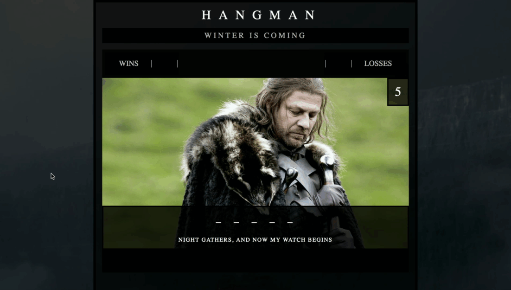

# Game of Thrones Hangman

**DESCRIPTION:** Hangman-style game that takes on a Game of Thrones theme





**GAMEPLAY**

* User presses any key to start and a random name of a G.O.T character is generated.
* On any key press, the game runs and determines if guess matches remaining letters in chosen character's name
* If all letters are guessed correctly, 1 win is added and the user is prompted for a new game.
* If the user exhausts all lives (5) 1 loss is tallied and the user is prompted for a new game.
* App will reject previously guessed letters and all keyboard clicks that are not 'alpha-numeric'
* Guesses are not case sensitive

**PROGRAMMING / FUNCTIONALITY**

* App is built using the following languages/libraries:
  - *HTML* 
  - *CSS* 
  - *JavaScript*
* Message display will tease the user with randomly chosen quotes from G.O.T. depending on there performance of each round
* Certain text colors will progressively be shifted to a *redder* hue for each incorrect guess.
* With each incorrect guess,  The display image will change to one that places Sean Bean's character, Eddard Stark slightly closer to execution - until the always inevitable downfall of Sean Bean

**FILE PATH**

```
Word-Guess-Game
├── README.md
├── assets
│   ├── css
│   │   ├── images
│   │   ├── reset.css
│   │   └── style.css
│   ├── images
│   │   ├── 0_lives.jpg
│   │   ├── 1_lives.jpg
│   │   ├── 2_lives.jpg
│   │   ├── 3_lives.jpg
│   │   ├── 4_lives.jpg
│   │   ├── 5_lives.jpg
│   │   ├── _0000_5.jpg
│   │   ├── _0001_4.jpg
│   │   ├── _0002_3.jpg
│   │   ├── _0003_2.jpg
│   │   ├── _0004_1.jpg
│   │   ├── character.psd
│   │   ├── ned-stark.psd
│   │   ├── wall.png
│   │   └── win.jpg
│   └── javascript
│       └── game.js
└── index.html

```